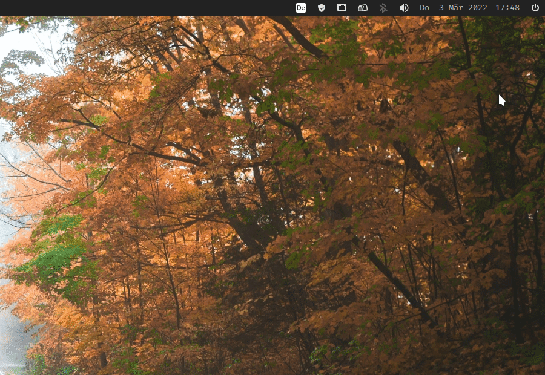
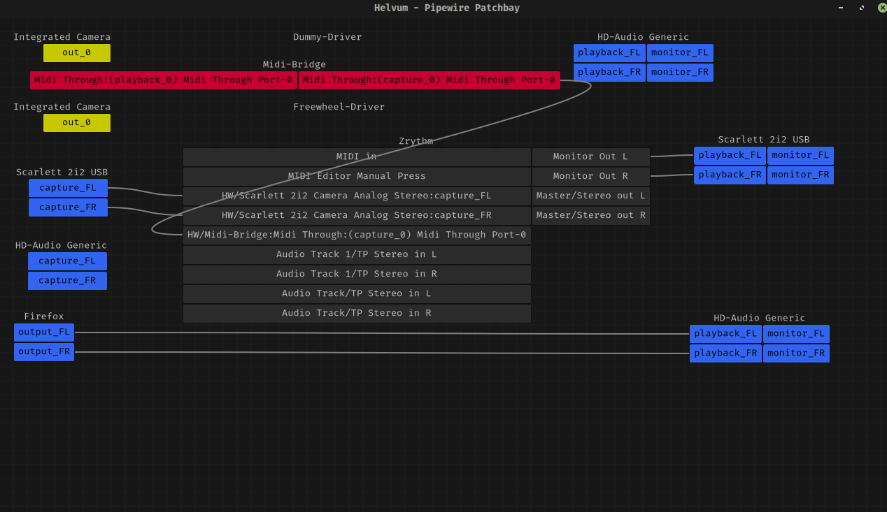
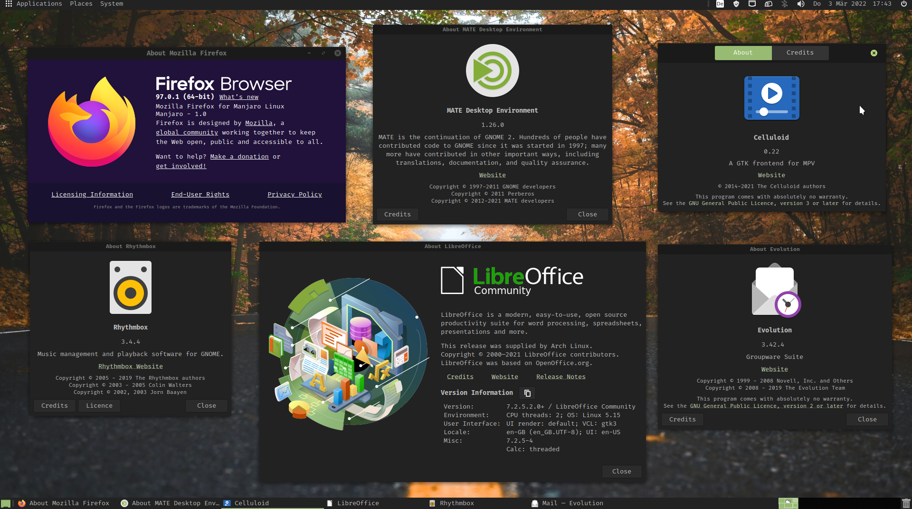
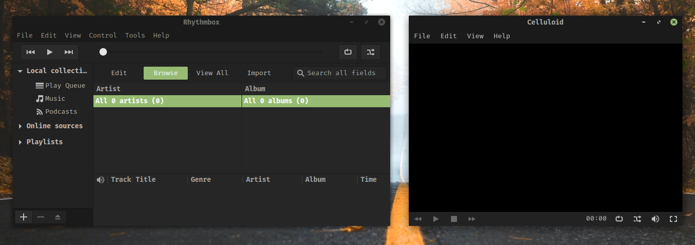
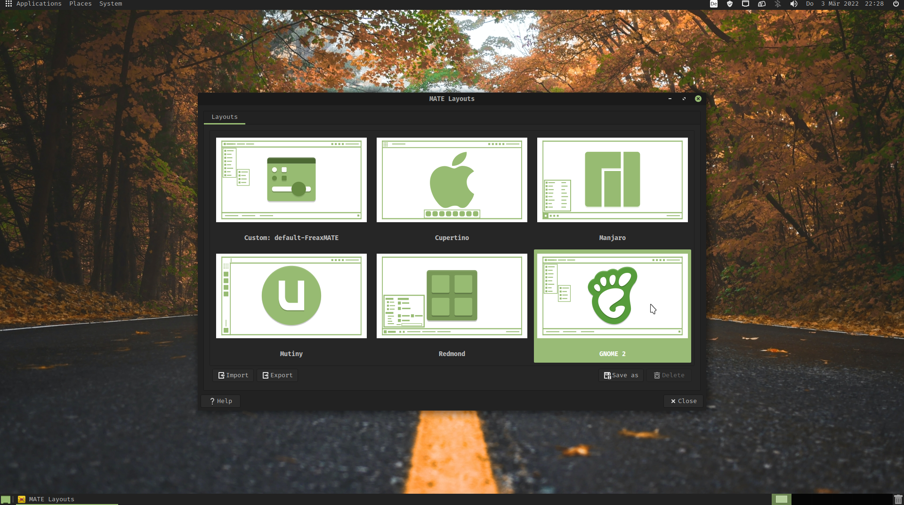
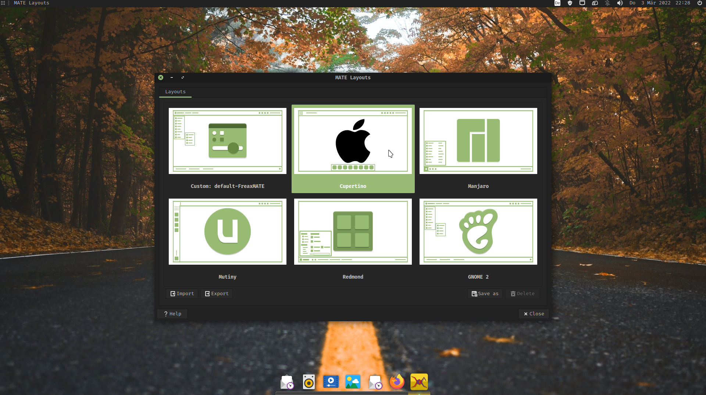
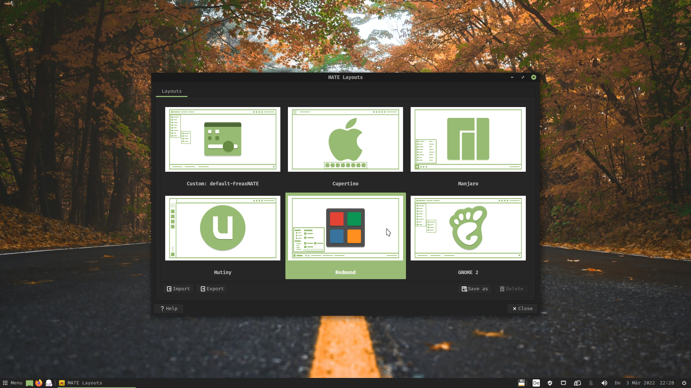
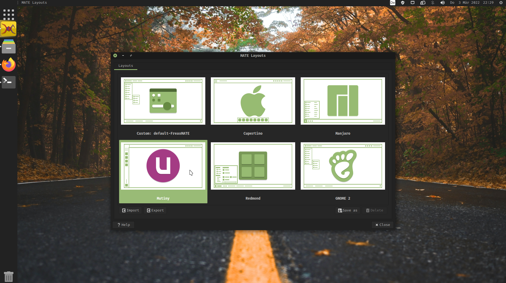
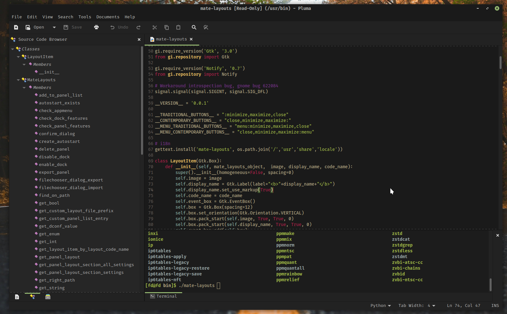
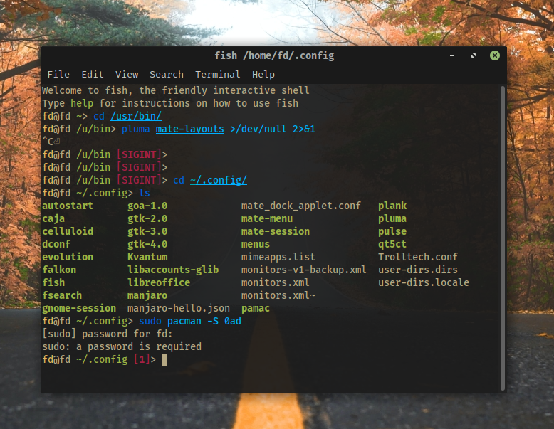

Hi there 👋,

welcome to my new website, this is my first post here 🎉 - It is about a customized Manjaro MATE ISO I created.

My favourite desktop environment currently is the MATE Desktop, however especially for new users it is not a very user-friendly implementation in most distributions. So I personally always configured the stock MATE experience to make it much more usable and polished. But actually you should not have to do so much to get an acceptable experience out of a desktop environment.

A Distribution doing a great job with their MATE Edition is Ubuntu MATE. I used to run this Distribution but much more prefer Manjaro/ Arch Linux as the backend. That's why I changed to Manjaro MATE and they're definitely better than some other Distribution with the MATE Desktop but not quite as good as Ubuntu MATE. So I created a customized Manjaro MATE ISO 🎉 🎊

---
# Features

## Ayatana Indicators

The most important change of the new Manjaro MATE Spin is the integration of [Ayatana Indicators](https://github.com/AyatanaIndicators). They describe the project as follows:

>Application Indicators are a GNOME implementation of the StatusNotifierItem Specification (SNI) that was originally submitted to freedesktop.org by KDE. The Ayatana Indicator project intends to become the new upstream for application indicators and associated projects with a focus on making Ayatana Indicators a desktop agnostic technology.

They have some great advantages compared to the default MATE Notification Area:

1. Consistent sharp rendering of status icons
2. [MPRIS](https://wiki.archlinux.org/title/MPRIS)-support for controlling media players
3. Calendar Synchronization with [Evolution](https://help.gnome.org/users/evolution/stable/)
4. Notification manager

## Pipewire

The default sound system included in the ISO is [Pipewire](https://pipewire.org/)

>PipeWire is a project that aims to greatly improve handling of audio and video under Linux. It provides a low-latency, graph based processing engine on top of audio and video devices that can be used to support the use cases currently handled by both pulseaudio and JACK. PipeWire was designed with a powerful security model that makes interacting with audio and video devices from containerized applications easy, with supporting Flatpak applications being the primary goal. Alongside Wayland and Flatpak we expect PipeWire to provide a core building block for the future of Linux application development.
>
>   - Capture and playback of audio and video with minimal latency.
>   - Real-time Multimedia processing on audio and video.
>   - Multiprocess architecture to let applications share multimedia content.
>   - Seamless support for PulseAudio, JACK, ALSA and GStreamer applications.
>   - Sandboxed applications support. See Flatpak for more info.
>

To be in full control of your audio streams the minimal patchbay [Helvum](https://gitlab.freedesktop.org/pipewire/helvum) has been included

## Classy curated apps

The main applications included in the ISO are not surprising but some nice apps were included.

The default Browser is of course [Firefox](https://www.mozilla.org/en-US/firefox/new/). As a default Office Suite the robust [Libre Office](https://www.libreoffice.org/) is shipped with the beautiful [Libreoffice style Yaru](https://github.com/ubuntu/libreoffice-style-yaru-fullcolor) icon theme. Coming to Multimedia: [Celluloid](https://celluloid-player.github.io/) is the default video player and [Rhythmbox](https://wiki.gnome.org/Apps/Rhythmbox) as a music player. Celluloid defaults to the classic window border layout and Rhythmbox is pimped with the the [Alternative Toolbar Plugin](https://github.com/fossfreedom/alternative-toolbar).

To organize your Mails the GTK-based [Evolution](https://help.gnome.org/users/evolution/stable/) E-Mail client is shipped, providing integration with the Ayatana Calendar Indicator.

Instead of the rather slow stock MATE search tool, the powerful [FSearch](https://github.com/cboxdoerfer/fsearch) is here to let you search for files instantaneously and fast.

For the security of you accounts the password manager [Secrets](https://gitlab.gnome.org/World/PasswordSafe) and [Seahorse](https://wiki.gnome.org/Apps/Seahorse/) is installed by default.

The default shell is [Fish](https://fishshell.com/), to make the command line more approacheble for new Linux users and more efficient for all users.

[MATE Layouts](https://github.com/FreaxMATE/mate-layouts) (based on [MATE Tweak](https://github.com/ubuntu-mate/mate-tweak)) lets you quickly switch between different panel layouts to get a user experience similiar to Windows, Mac, the old Unity or simply the productive Gnome 2 Layout which is the default one.

## App Plugins

For Caja there is now by default the [caja-admin](https://github.com/infirit/caja-admin) plugin installed. So you can open directories or edit root files as administrator.

Additionally for the text editor Pluma the official MATE package [pluma-plugin](https://github.com/mate-desktop/pluma-plugins) is now included by default. This transforms Pluma to a usable IDE with some plugins like bracket and word completion, quickhighlight, source-code browser:

## Miscellaneous

### Themes

The default theme is now the slick looking [Matcha-dark-pueril](https://github.com/vinceliuice/Matcha-gtk-theme) theme in a MATE green style, which I [helped creating](https://github.com/vinceliuice/Matcha-gtk-theme/pull/174). Especially for this theme I created a custom green styled [Papirus Folders](https://github.com/FreaxMATE/papirus-mate-icon-theme) for the used [Papirus Icon Theme](https://github.com/PapirusDevelopmentTeam/papirus-icon-theme).

For Pluma and the [MATE Terminal](https://github.com/mate-desktop/mate-terminal) there is a new elegant and consistent theme:

As you saw in this pictures the default font across the whole desktop is [Fira Code](https://github.com/tonsky/FiraCode).

### Wallpapers

Here are some of wallpapers included in the ISO:

 on [Unsplash](https://unsplash.com/)")

 on [Unsplash](https://unsplash.com/)")

 on [Unsplash](https://unsplash.com/)")

 on [Unsplash](https://unsplash.com/)")

## Download ISO


You can download the ISO [here](https://github.com/FreaxMATE/manjaro-iso-build/releases)


The ISO consists of two files because Github cannot handel files larger than 2 GB. You can find the guide on how to merge them in the [README](https://github.com/FreaxMATE/manjaro-iso-build)


## Future Ideas

 - set [Picom](https://wiki.archlinux.org/title/Picom) default compositor

