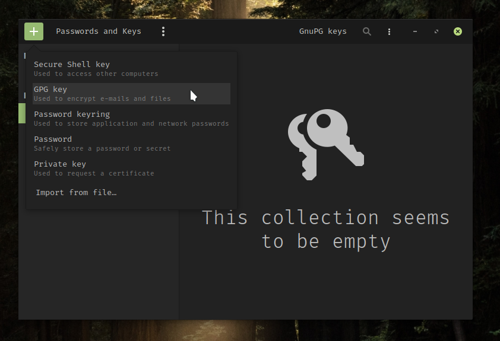
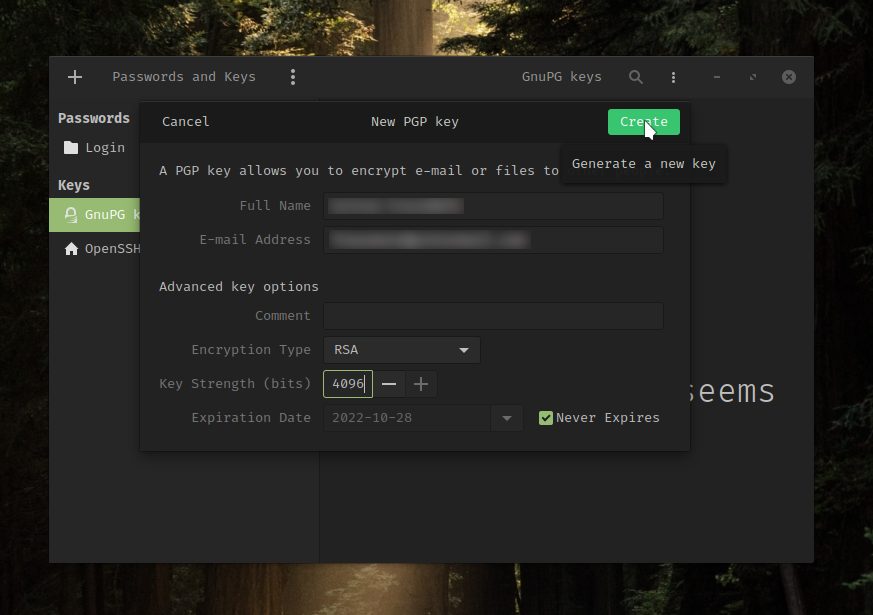
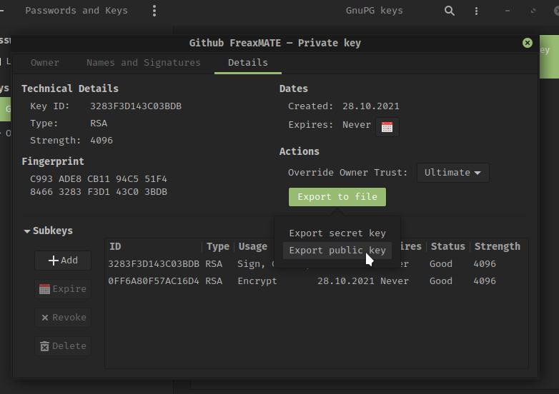

## Overview

Git is a free and open source code version control system. It was originally developed by Linus Torvalds himself with the first release back in 2005.
SSH and GPG are quite interesting for the use with git however there are not many easy guides on how to set these up. So here is a compact article.

## Get Started

When trying to create your first commit git wants to know some info about you:

```
Author identity unknown

*** Please tell me who you are.

Run

  git config --global user.email "you@example.com"
  git config --global user.name "Your Name"

to set your account's default identity.
Omit --global to set the identity only in this repository.

```

So obviously follow the instructions and configure your email and name with:

```
git config --global user.email "you@example.com"
git config --global user.name "Your Name"
```

## GPG key

First you can install the seahorse app, a password & encryption key manager. Using Arch Linux or Manjaro you can do that with:

```
sudo pacman -S seahorse
```

Then add a GPG key.



Enter a name, and the same email address that you use for your Github account.



After entering the passphrase for this key export the public key.



Copy the content of the exported file, sign in to your Github account and go 
to **Settings->SSH and GPG keys->New GPG key** and paste the public key there.

Now go back to seahorse and copy the key ID from the properties dialog of your GPG key (double click on the key).
Then you need to tell Git about your GPG key with:

```
git config --global user.signingkey <KEY_ID>
```
*(replace \<KEY_ID> with your actual key ID)*

**Finished!** 💪 🎊 

From now on you can sign your commits with:

```
git commit -S -m "Hooray I can sign my commits"
```

## SSH key

Using SSH you do not have to enter your token or password every time you push a commit to github.
In seahorse click **+** then select *Secure Shell key*. Enter a brief description then click *Create and set up* and enter a passphrase.
To get the public double click on the ssh key to get to the properties dialog.
There is a Copy icon next to the *Public Key* label. After clicking it your public key is saved in your clipboard.
All you have to do now is adding your SSH key to Github.
Therefore sign in to your Github account and go to **Settings->SSH and GPG keys->New SSH key**.
There you have a title and copy your public key in the box below.

**Great!** 🎉 If you want to force git to always use SSH instead of HTTPS you can do that with:

```
git config --global url."git@github.com:".insteadOf "https://github.com/"
```

**I hoped this post helped you! Happy coding!**

## Sources

[Github Authentication] https://docs.github.com/en/enterprise-server@3.0/authentication

[Github force SSH] https://ricostacruz.com/til/github-always-ssh


