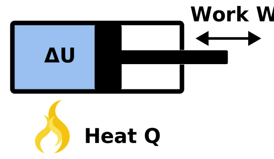


## Introduction

Let's say we have come gas trapped inside a cylinder with a piston preventing it from leaking. Now if we want to change the inner energy of the gas we can - according to the first law of Thermodaynamics - either add/remove heat from the system or do work on the gas or let the gas do work on the environment.

In a formula you can write the first law of Thermodynamics like this


#### First law of Thermodynamics
$$dU = dQ + dW$$
where \\(dU\\) is the change of the inner energy of the gas, \\(dQ\\) is the amount exchanged heat and \\(dW\\) is the amount of work being done on the gas/ on the environment.


## Adiabatic process

Per definition during an adiabatic process no heat is exchanged with the environment. This can e.g. be approximately true for a very fast change in volume where there is almost no time to allow heat flow during this process.
For us this is very convinient as we can now write the first law like this

$$dU = dW$$

The inner energy \\(U\\) for an ideal gas is defined by
$$U = \frac{f}{2} N k_B T$$
where \\(f\\) is the degree of freedom for the gas, 
\\(N\\) the number of gas particles, \\(k_B\\) the Boltzmann constant and \\(T\\) the temperature of the gas.
As \\(T\\) is the only variable that might change during the adiabatc process we can write the change of inner energy as
$$dU = \frac{f}{2} N k_B dT$$

The work done on the gas/ on the environment is given by
$$dW = -p dV$$
where \\(p\\) is the pressure and \\(dV\\) the change of volume during the process.

Combining those to the first equation we get
$$\frac{f}{2} N k_B dT = -p dV$$

Now let's introduce probably the most essential identity of Thermodynamics

#### The ideal gas law
$$p V = N k_B T$$
where \\(p\\) is the pressure, \\(V\\) the volume, \\(N\\) the number of gas particles, \\(k_B\\) the Boltzmann constant and \\(T\\) the temperature of the gas.


We can now apply the differential operator to get \\(dp V + p dV = N k_B dT\\) and insert this into our equation
$$\frac{f}{2} (V dp + p dV)  = -p dV$$
$$(\frac{f}{2}+1) p dV = -\frac{f}{2} V dp$$
$$\frac{f+2}{f} \frac{1}{V} dV = -\frac{1}{p} dp$$

where one defines \\(\gamma = \frac{f+2}{f}\\) as the adiabatic index.

Let's integrate this equation on both sides

$$\gamma ln(V) = -ln(p) + const.$$

Using \\(a ln(x) = ln(x^a)\\) and \\(ln(x) + ln(y) = ln(xy)\\) we get

$$p V^\gamma = const.$$
where \\(p\\) is the pressure, \\(V\\) the volume and \\(\gamma\\) the adiabatic index of the gas.


Now by inserting \\(p = \frac{1}{V} N k_B T\\) we get
$$N k_B T V^{-1} V^\gamma = const.$$

$$ T V^{\gamma-1} = const.$$
where \\(T\\) is the temperature, \\(V\\) the volume and \\(\gamma\\) the adiabatic index of the gas.



## Sources

[Inkscape Tutorial: Vector Flame Icon](https://invidious.snopyta.org/watch?v=UjmER3xMC0o)
