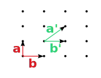
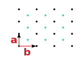
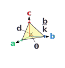
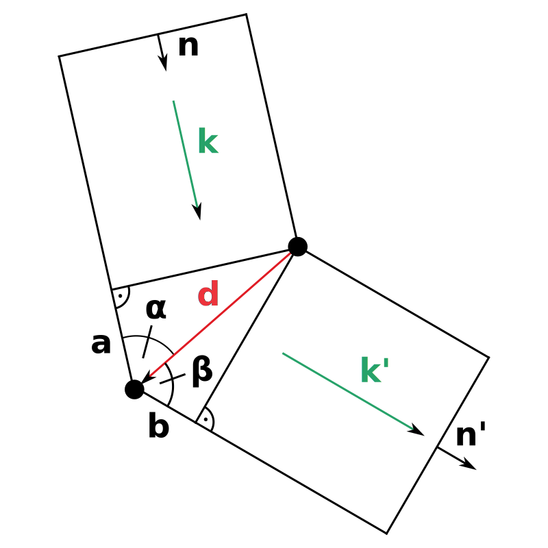



## Introduction

## Basics

To begin let's just define some basic principals that are important to understand Solid State Physics.

### Structure and Unit Cells

Points in space that are ordered in a specific way so you can describe the position of every point by a combination of lattice vectors

$$\vec{r} = u \vec{a} + v \vec{b} + w \vec{c}$$

is called a **lattice**. The lattice vectors are not distinct and can be chosen in different ways.

The lattice points are only points in space, to describe a **structure** we need to add a **basis** that contains the position of the atoms relative to the lattice. The basis can only contain the null-vector so that the atoms lie exactly on the lattice points. If we on the other hand had two basis vectors \\(\vec{p_1} = (0, 0) \text{ and } \vec{p_2} = (\frac{1}{2}, \frac{1}{2})\\) we would get the following *structure*

One can define a unit cell for a unit cell for a lattice which then describes the whole lattice by translation of the cell, e.g. the following for a simple lattice

However there would have been many possibilities. There is a definition for a distinct cell that is the **Wigner-Seitz Unit Cell**. It consist all points that are closer to the lattice point than to any other lattice point. 

### Common lattices

Now let's look at actual lattices in three dimensions. There are three basic ones everyone should know.

#### Simple Cubic (SC) lattice

As the name suggests this lattice contains just the corners of a cube.
The lattice vectors are \\(\vec{a_1} = (a, 0, 0)\\), \\(\vec{a_2} = (0, a, 0)\\) and \\(\vec{a_3} = (0, 0, a)\\).

")

#### Face Centered Cubic (FCC) lattice

Another important lattice similar to SC-lattice but with additional lattice points at each face of the cube.
The lattice vectors are \\(\vec{a_1} = (\frac{a}{2}, \frac{a}{2}, 0)\\), \\(\vec{a_2} = (\frac{a}{2}, 0, \frac{a}{2})\\) and \\(\vec{a_3} = (0, \frac{a}{2}, \frac{a}{2})\\).

")

#### Body Centered Cubic (BCC) lattice

Lastly there is the SC-lattice but one additional lattice points at the center of the cube.
The lattice vectors are \\(\vec{a_1} = (a, 0, 0)\\), \\(\vec{a_2} = (0, a, 0)\\) and \\(\vec{a_3} = (\frac{a}{2}, \frac{a}{2}, \frac{a}{2})\\).

")

### Miller Indices

There are many different planes one can consider in a crystal. To be able to distinctly differentiate between different planes one uses the **Miller Indices** \\(h, k, l\\).

The plane then intercepts the axes at \\(\frac{\vec{a}}{h}\text{, }\frac{\vec{b}}{k}\text{ and }\frac{\vec{c}}{l}\\) and does not intercept an axis at all if the corresponding index is \\(0\\).
We can now relate the axes intersections to the distance between the planes.

$$\frac{\vec{a}}{h} \cdot \vec{d} = \frac{|\vec{a}|}{h}\\ d\\ \cos{\theta} = d^2 $$

as \\(\vec{d}\text{, }\vec{a}\\) and the plane create a right triangle. This is of course true for all lattice vectors. After multiplying by \\(2\pi\\) we get the following relation

$$\vec{a} \frac{2 \pi \vec{d}}{d^2} = 2 \pi h$$
$$\vec{b} \frac{2 \pi \vec{d}}{d^2} = 2 \pi l$$
$$\vec{c} \frac{2 \pi \vec{d}}{d^2} = 2 \pi k$$

This for now seems kind of arbitrary but we will need it later.

")

### The Reciprocal Lattice

We know that we can write the direct lattice as arbitrary combinations of the lattice vectors \\(\vec{R} = u\vec{a} + v\vec{b} + w\vec{c}\\). We can calculate the reciprocal lattice vectors as follows

$$\vec{a}^* = \frac{2 \pi (\vec{b} \times \vec{c})}{\vec{a}(\vec{b} \times \vec{c})}$$

$$\vec{b}^* = \frac{2 \pi (\vec{c} \times \vec{a})}{\vec{a}(\vec{b} \times \vec{c})}$$

$$\vec{c}^* = \frac{2 \pi (\vec{a} \times \vec{b})}{\vec{a}(\vec{b} \times \vec{c})}$$

So that we can define the reciprocal lattice

$$\vec{G}_{h,k,l} = h\vec{a}^* + k\vec{b}^* + l\vec{c}^*$$

The reciprocal lattice for common lattice we defined earlier can be seen in the following table

| direct lattice | reciprocal lattice                 |
|---------------|-------------------------------------|
| **SC** (with side \\(\boldsymbol{a}\\)) | **SC** (with side \\(\boldsymbol{\frac{2 \pi}{a}})\\)   |
| **FCC** (with side \\(\boldsymbol{a}\\)) | **BCC** (with side \\(\boldsymbol{\frac{4 \pi}{a}})\\)   |
| **BCC** (with side \\(\boldsymbol{a}\\)) | **FCC** (with side \\(\boldsymbol{\frac{4 \pi}{a}})\\)   |

## Waves in Crystals

Now let's consider a plane (e.g. electromagnetic) wave that interacts with a certain lattice. The wave will scatter at the atoms and we want to determine in which directions the outgoing waves constructively interfere with each other. Let's start by looking at only two lattice points. We have an incoming wave with wave vector \\(\vec{k}\\) and the vector connecting the two lattice points is \\(\vec{d}\\).

The wave's path difference between the two lattice points is \\(a+b\\). We can calculate their length in relation to \\(\vec{d}\\) and the angles \\(\alpha\\) and \\(\beta\\).

The incoming wave vector is \\(\vec{k} = \frac{2\pi}{\lambda} \vec{n}\\) and the outgoing wave vector \\(\vec{k'} = \frac{2\pi}{\lambda} \vec{n'}\\).

The length \\(a\\) can be expressed as

$$a = |\vec{d}| cos \alpha = \vec{d} \cdot  \vec{n}$$

and similar \\(b\\)

$$b = |\vec{d}| cos \beta = - \vec{d} \cdot  \vec{n'}$$

So to get constructive interference the sum of \\(a\\) and \\(b\\) has to be a multiple of the wavelength \\(\lambda\\)

$$\vec{d} (\vec{n} - \vec{n'}) = m \lambda$$

To get the relation between the wave vector itself we multiply with \\(\frac{2\pi}{\lambda}\\) and thus get

$$\vec{d} (\vec{k} - \vec{k'}) = \vec{d} \cdot \vec{K} = 2 \pi m$$

We have to consider the whole lattice so \\(\vec{d} = u\vec{a} + v\vec{b} + w\vec{c}\\) so that the conditions for all different \\(\vec{d}\\) must be met. These are the


#### Laue Conditions

$$\vec{K} \cdot \vec{a} = 2 \pi H$$

$$\vec{K} \cdot \vec{b} = 2 \pi K$$

$$\vec{K} \cdot \vec{c} = 2 \pi L$$


As we discussed earlier the reciprocal lattice \\(\vec{G}\\) is given by

$$\vec{G_{h,k,l}} = h \vec{a}^* + k \vec{b}^* + l \vec{c}^*$$

One can proof tand all scattering vectors that are equal to a reciprocal lattice vector

$$\vec{K} = \vec{G_{h,k,l}}$$

fulfill the Laue conditions, which means

$$\vec{G_{h,k,l}} \cdot \vec{a} = 2 \pi h$$
$$\vec{G_{h,k,l}} \cdot \vec{b} = 2 \pi k$$
$$\vec{G_{h,k,l}} \cdot \vec{c} = 2 \pi l$$

As we showed earlier

$$\vec{a}^* = \frac{2 \pi (\vec{b} \times \vec{c})}{\vec{a}(\vec{b} \times \vec{c})}$$

$$\vec{b}^* = \frac{2 \pi (\vec{c} \times \vec{a})}{\vec{a}(\vec{b} \times \vec{c})}$$

$$\vec{c}^* = \frac{2 \pi (\vec{a} \times \vec{b})}{\vec{a}(\vec{b} \times \vec{c})}$$

So we can conclude a relation between the physical distance between planes and the reciprocal lattice vector

$$\vec{G_{h,k,l}} = \frac{2 \pi \vec{d}}{d^2}$$

which means \\(\boldsymbol{G_{h,k,l}}\\) is **parallel to \\(\boldsymbol{\vec{d}}\\)** and **perpendicular to the** \\(\boldsymbol{h,k,l}\\)**-plane**.

We can describe the incoming wave with wavevector \\(\vec{k}\\) and angular frequency \\(\omega\\)

$$A e^{i(\vec{k} \cdot \vec{r} - \omega t)}$$

The outgoing wave with wavevector \\(\vec{k'}\\) and same frequency (we assume elastic scattering) is then

$$A e^{i(\vec{k'} \cdot \vec{r} - \omega t)} f_0 + A e^{i(\vec{k'} \cdot \vec{r} - \vec{K} \cdot \vec{r_1} - \omega t)} f_1 + A e^{i(\vec{k'} \cdot \vec{r} - \vec{K} \cdot \vec{r_2} - \omega t)} f_2 + \dots$$

where \\(f_n\\) are the scattering probabilities. It simplifies to 

$$A_{tot} e^{i(\vec{k'} \cdot \vec{r} - \omega t)}$$

where

$$A_{tot} = \sum_n e^{-i(\vec{K} \cdot \vec{r_n})} f_n = \sum_l e^{-i(\vec{K} \cdot \vec{r_l})} \sum_p e^{-i(\vec{K} \cdot \vec{r_l})}f_n$$

We call

$$S = \sum_p e^{-i(\vec{K} \cdot \vec{r_l})}f_n$$

the **structure factor**.

## Sources

https://courses.cit.cornell.edu/ece407/Lectures/handout4.pdf \
https://courses.cit.cornell.edu/mse5470/handout5.pdf \
[Introduction to Solid State Physics, Umeå Universitet, Sune Pettersson](https://www.umu.se/en/education/courses/introduction-to-solid-state-physics/) \
[Experimentalphysik 3 Atome, Moleküle und Festkörper, Wolfgang Demtröder](https://link.springer.com/book/10.1007/978-3-662-49094-5)